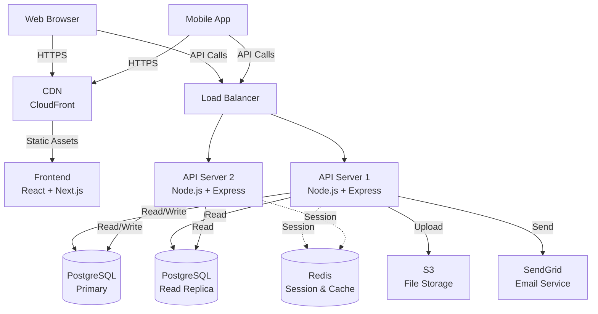
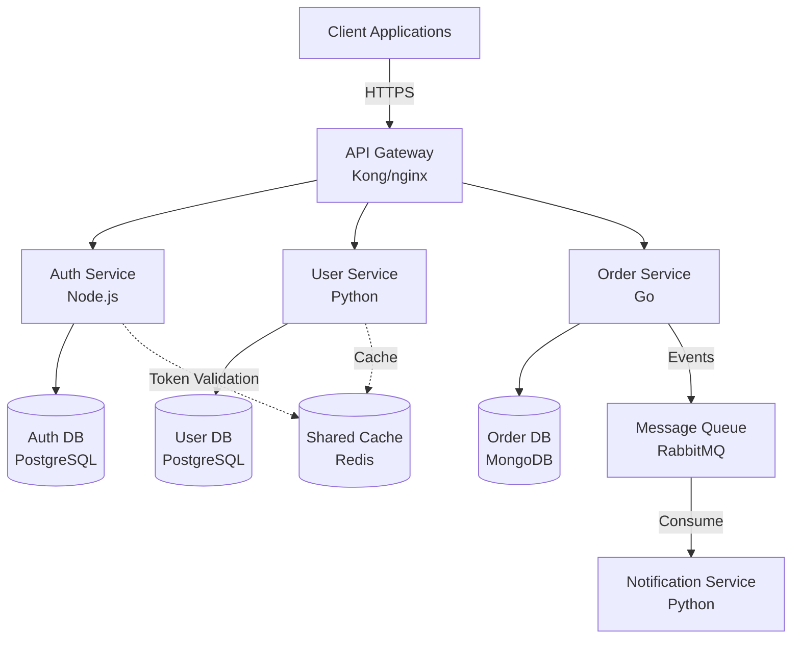
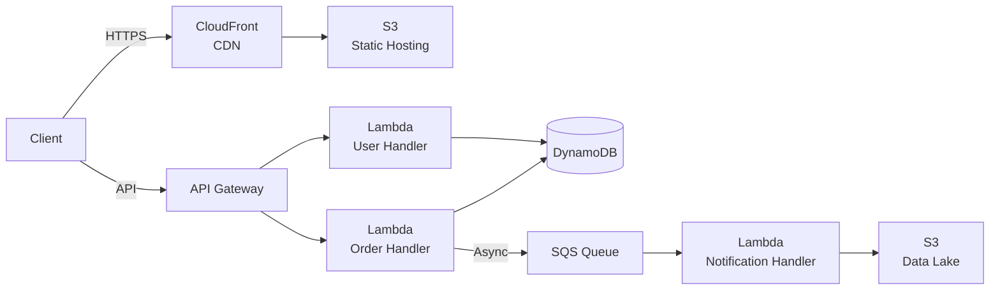
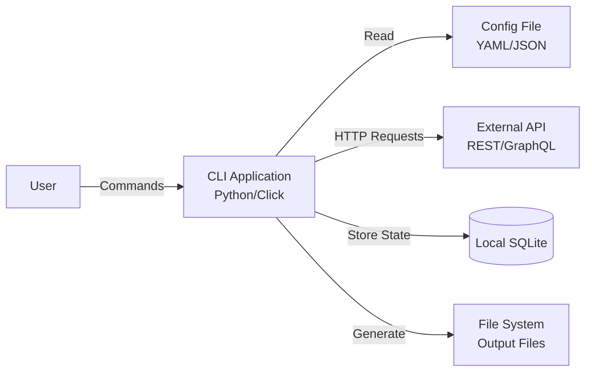

# ARCHITECTURE.md 作成ガイド

このドキュメントは、高品質なARCHITECTURE.mdを生成するためのベストプラクティスとパターン集です。

## ドキュメントの目的

ARCHITECTURE.mdは以下の読者を対象とします:

1. **新規参加者**: プロジェクトの全体像を素早く理解
2. **開発者**: システムの構造と依存関係を把握
3. **レビュアー**: アーキテクチャの妥当性を評価

## セクション別ガイドライン

### 1. Overview セクション

#### 基本原則

- **簡潔性**: 2-3段落に収める
- **具体性**: 「高性能」ではなく「1000 req/sec処理」
- **完全性**: 技術スタックの全主要要素を含む

#### テンプレート

```markdown
## Overview

[プロジェクト名] is a [タイプ] that [主な目的].

**Tech Stack:**
- **Language:** [言語] ([バージョン])
- **Framework:** [主要フレームワーク]
- **Database:** [データベース種類とバージョン]
- **Cache:** [キャッシュシステム]（該当する場合）
- **Infrastructure:** [AWS/GCP/Azure/オンプレ]

**Architecture Style:** [モノリス/マイクロサービス/サーバーレス/レイヤードアーキテクチャ]
```

#### 良い例

```markdown
## Overview

TaskManager is a real-time collaborative task management application that enables teams to organize and track work efficiently.

**Tech Stack:**
- **Language:** TypeScript (5.0+)
- **Frontend:** React 18 with Next.js 13
- **Backend:** Node.js with Express
- **Database:** PostgreSQL 15
- **Cache:** Redis 7
- **Infrastructure:** AWS (ECS, RDS, ElastiCache)

**Architecture Style:** Monolithic backend with client-side rendering
```

#### 避けるべきパターン

❌ **曖昧な表現:**
```markdown
This is a modern web application using the latest technologies.
```

❌ **不完全な情報:**
```markdown
Built with JavaScript and a database.
```

### 2. System Diagram セクション

#### Mermaid構成図のベストプラクティス

##### パターン1: Webアプリケーション（3層アーキテクチャ）



**ポイント:**
- 層ごとにコンポーネントをグループ化
- 実線 `-->` は主要なデータフロー
- 点線 `-.->` はオプショナルまたはキャッシュフロー
- ノード内に技術スタックを明記 `<br/>` で改行

##### パターン2: マイクロサービス



**ポイント:**
- サービスごとのデータベース分離を明示
- メッセージキューによる非同期通信を表現
- 共有キャッシュと専用DBの違いを視覚化

##### パターン3: サーバーレス



##### パターン4: CLIツール



#### 構成図のデザイン原則

1. **方向性の統一**
   - 基本は `TB` (Top to Bottom)
   - 横長のフローは `LR` (Left to Right)

2. **ノード形状の意味付け**
   - `[]` 長方形: アプリケーション、サービス
   - `[()]` 円柱: データベース、ストレージ
   - `()` 丸角: 外部サービス、クライアント

3. **矢印の使い分け**
   - `-->` 実線: 主要なリクエスト/レスポンス
   - `-.->` 点線: キャッシュアクセス、オプショナルなフロー
   - `==>` 太線: 高頻度/重要なフロー

4. **ラベルの付け方**
   - プロトコル: `|HTTPS|`, `|gRPC|`
   - 処理内容: `|Read|`, `|Write|`, `|Events|`

5. **色の使用（オプション）**
   ```mermaid
   graph TB
       A[Component A]
       B[Component B]
       style A fill:#f9f,stroke:#333,stroke-width:2px
       style B fill:#bbf,stroke:#333,stroke-width:2px
   ```

### 3. External Services セクション

#### 外部サービスの検出と文書化

**検出方法:**

1. **環境変数から検出:**
   ```bash
   # .env.example をチェック
   STRIPE_API_KEY=
   AWS_ACCESS_KEY_ID=
   SENDGRID_API_KEY=
   ```

2. **コード内のSDK使用を検出:**
   ```bash
   # Node.js
   grep -r "require.*aws-sdk" src/
   grep -r "import.*@stripe" src/

   # Python
   grep -r "import boto3" .
   grep -r "from stripe" .
   ```

3. **設定ファイルから検出:**
   ```bash
   # Firebase
   find . -name "firebase.json"

   # Docker Compose（サービス依存）
   cat docker-compose.yml | grep "image:"
   ```

**出力フォーマット:**

```markdown
## External Services

**Cloud Services:**
- **AWS S3** - Object storage for user uploads
- **AWS CloudFront** - CDN for static assets
- **AWS SES** - Email delivery service

**Third-Party APIs:**
- **Stripe** - Payment processing
- **SendGrid** - Transactional emails
- **Google Maps API** - Geolocation services

**Monitoring & Analytics:**
- **Sentry** - Error tracking
- **Google Analytics** - User analytics
- **DataDog** - Infrastructure monitoring
```

**各サービスの記載内容:**
- サービス名
- カテゴリ（Cloud/API/Monitoring等）
- 用途（1行説明）

### 4. Code Map セクション

#### Directory Structure（ディレクトリ構造）

##### 一般的なパターン

**Webアプリケーション（React/Next.js）:**
```
src/
├── app/              # Next.js 13 App Router
│   ├── (auth)/       # Auth group routes
│   ├── api/          # API routes
│   └── (dashboard)/  # Dashboard routes
├── components/       # Reusable React components
│   ├── ui/           # UI primitives (Button, Input, etc.)
│   └── features/     # Feature-specific components
├── lib/              # Utility libraries
│   ├── api/          # API client functions
│   ├── hooks/        # Custom React hooks
│   └── utils/        # Helper functions
├── types/            # TypeScript type definitions
└── config/           # Configuration files
```

**バックエンドAPI（Node.js/Express）:**
```
src/
├── routes/           # API route definitions
├── controllers/      # Request handlers
├── services/         # Business logic
├── models/           # Database models
├── middleware/       # Express middleware
├── utils/            # Utility functions
├── config/           # Configuration
└── types/            # TypeScript types
```

**マイクロサービス（Go）:**
```
cmd/
└── api/              # Application entry point
internal/
├── handler/          # HTTP handlers
├── service/          # Business logic
├── repository/       # Data access layer
├── model/            # Domain models
└── config/           # Configuration
pkg/                  # Public libraries
tests/                # Test files
```

**Python（Django）:**
```
project/
├── apps/             # Django applications
│   ├── users/        # User app
│   ├── orders/       # Order app
│   └── common/       # Shared utilities
├── config/           # Project settings
│   ├── settings/     # Environment-specific settings
│   └── urls.py       # URL configuration
├── static/           # Static files
├── templates/        # HTML templates
└── tests/            # Tests
```

##### 注釈のベストプラクティス

**良い例:**
```
src/
├── components/       # Reusable UI components (atomic design)
├── services/         # Business logic and external API integration
├── models/           # Mongoose schemas and database models
```

**避けるべき例:**
```
src/
├── components/       # Files
├── services/         # Code
├── models/           # Stuff
```

## プロジェクトタイプ別のチェックリスト

### Webアプリケーション

- [ ] フロントエンドとバックエンドの分離を図示
- [ ] データベース接続を明記
- [ ] 認証フローを構成図に含める
- [ ] CDN/静的アセット配信を記載
- [ ] APIエンドポイントのルート構造を説明

### マイクロサービス

- [ ] サービス間通信プロトコルを明記（HTTP/gRPC/Message Queue）
- [ ] 各サービスの責務を明確化
- [ ] データベースの分離を図示
- [ ] API Gatewayやサービスメッシュを記載
- [ ] 非同期処理フローを説明

### CLIツール

- [ ] コマンド構造を説明
- [ ] 外部APIとの連携を図示
- [ ] 設定ファイルの場所と形式
- [ ] 出力ファイルの種類と用途
- [ ] プラグインや拡張機構（該当する場合）

### ライブラリ/SDK

- [ ] 公開APIのエントリーポイント
- [ ] モジュール構成と依存関係
- [ ] プラグインアーキテクチャ（該当する場合）
- [ ] 外部依存の最小化を明記
- [ ] バージョン互換性ポリシー

## よくある質問

### Q: Mermaid構成図が複雑すぎる場合は?

**A:** 複数の図に分割します:
- **High-Level Diagram**: システム全体の概要
- **Service Detail Diagram**: 個別サービスの内部構造
- **Data Flow Diagram**: 特定のユースケースのフロー

### Q: モノレポの場合は?

**A:** パッケージごとにCode Mapを分けます:
```markdown
## Code Map

### Package: @myapp/frontend
[フロントエンドの構造]

### Package: @myapp/backend
[バックエンドの構造]

### Package: @myapp/shared
[共有コードの構造]
```

## 参考リソース

- [Mermaid公式ドキュメント](https://mermaid.js.org/)
- [C4 Model](https://c4model.com/) - システムアーキテクチャ図のベストプラクティス
- [Arc42](https://arc42.org/) - ソフトウェアアーキテクチャドキュメントテンプレート
