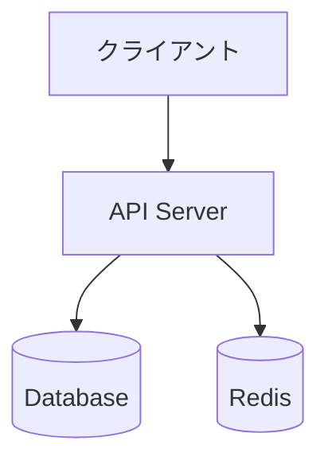

# Architecture MD Generator

## Overview

プロジェクトを分析してARCHITECTURE.mdを自動生成します。既存のプロジェクトメタデータ(CLAUDE.md、AGENTS.md)を参照しながら、システム図、外部依存関係、コードマップを含む包括的なアーキテクチャドキュメントを作成します。

## Quick Start

1. プロジェクトルートディレクトリで実行
2. CLAUDE.mdまたはAGENTS.mdが存在する場合、それらを参照
3. ディレクトリ構造と外部依存関係を自動検出
4. ARCHITECTURE.mdを生成

## Workflow

### Phase 1: プロジェクト分析

**目的:** 既存のプロジェクトメタデータを収集

**手順:**
1. CLAUDE.mdまたはAGENTS.mdの存在を確認
2. 存在する場合、ファイルを読み取りプロジェクト概要を抽出
3. 抽出した情報をARCHITECTUREの概要セクションに反映

**注意:**
- CLAUDE.md/AGENTS.mdの詳細な内容はARCHITECTURE.mdに複製しない
- 概要セクションには「詳細はCLAUDE.md/AGENTS.mdを参照」というノートを含める
- プロジェクトの簡潔な説明(1-2文)のみを記載

### Phase 2: 構造探索

**目的:** プロジェクトの構造と依存関係を把握

**ディレクトリスキャン:**
```
- Glob/Grepツールを使用
- 主要なディレクトリとファイルを特定
- 設定ファイル(package.json, requirements.txt, Cargo.tomlなど)を検出
```

**外部依存検出:**
```
- API呼び出しやHTTPクライアント使用箇所を検索
- 環境変数(.env, .env.example)をチェック
- データベース接続やサードパーティサービスを特定
```

### Phase 3: ドキュメント生成

**目的:** 収集した情報をARCHITECTURE.mdにまとめる

**生成する内容:**
1. **Overview** - プロジェクトの簡潔な説明
2. **System Diagram** - Mermaid flowchartダイアグラム
3. **External Dependencies** - 外部サービス一覧表
4. **Code Map** - ディレクトリ構造と説明

## Mermaid ダイアグラム ガイドライン

**基本原則:**
- flowchart TDまたはLRを使用
- ノードは主要コンポーネントを表現
- 矢印はデータフローや依存関係を示す

**例:**


**推奨事項:**
- シンプルで読みやすいレイアウト
- 5-10個のノードが理想的
- 複雑なシステムは階層化

## 出力フォーマット仕様

生成されるARCHITECTURE.mdは以下の構造に従います:

```markdown
# Architecture

## Overview

> **Note:** プロジェクトの詳細な概要については CLAUDE.md または AGENTS.md を参照してください。

[1-2文の簡潔なプロジェクト説明]

## System Diagram

```mermaid
[Mermaidダイアグラム]
```

## External Dependencies

| Service | Purpose | Configuration |
|---------|---------|---------------|
| [name]  | [desc]  | [env var]     |

## Code Map

```
[ディレクトリ構造ツリー]
```

[各ディレクトリの説明]
```

## References

詳細なテンプレートと例については以下を参照:
- `references/TEMPLATE.md` - ARCHITECTURE.mdの標準テンプレート
- `references/EXAMPLES.md` - プロジェクトタイプ別の例
