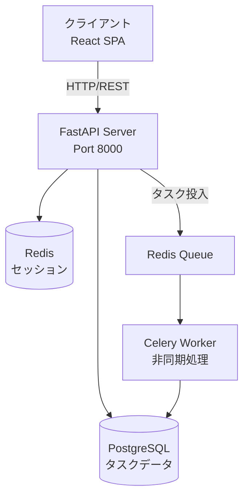
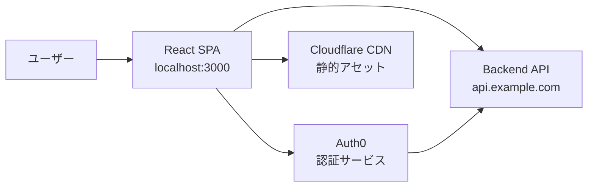

# ARCHITECTURE.md 例集

プロジェクトタイプ別のARCHITECTURE.mdの具体例です。

---

## 例1: Python FastAPI プロジェクト

```markdown
# Architecture

## Overview

> **Note:** プロジェクトの詳細な概要については CLAUDE.md を参照してください。

タスク管理APIサーバー。ユーザー認証、タスクCRUD、リアルタイム通知を提供します。

## System Diagram



## External Dependencies

| Service | Purpose | Configuration |
|---------|---------|---------------|
| PostgreSQL | タスクとユーザーデータの永続化 | `DATABASE_URL` |
| Redis | セッション管理とCeleryキュー | `REDIS_URL` |
| SendGrid | メール通知送信 | `SENDGRID_API_KEY` |
| AWS S3 | 添付ファイルストレージ | `AWS_ACCESS_KEY_ID`, `AWS_SECRET_ACCESS_KEY`, `S3_BUCKET_NAME` |

## Code Map

```
task-api/
├── app/
│   ├── api/
│   │   ├── routes/       # エンドポイント定義
│   │   │   ├── tasks.py  # タスクCRUD
│   │   │   ├── auth.py   # 認証
│   │   │   └── users.py  # ユーザー管理
│   │   └── dependencies.py  # 依存性注入
│   ├── core/
│   │   ├── config.py     # 設定管理
│   │   ├── security.py   # JWT認証
│   │   └── database.py   # DB接続
│   ├── models/
│   │   ├── task.py       # Taskモデル
│   │   └── user.py       # Userモデル
│   ├── schemas/
│   │   ├── task.py       # Pydanticスキーマ
│   │   └── user.py
│   ├── services/
│   │   ├── task_service.py   # タスクビジネスロジック
│   │   └── email_service.py  # メール送信
│   └── workers/
│       └── tasks.py      # Celeryタスク
├── tests/
│   ├── api/              # API統合テスト
│   └── services/         # サービス単体テスト
├── alembic/              # DBマイグレーション
└── requirements.txt
```

### app/api/routes/
FastAPIルーター定義。各ルートファイルはエンドポイントのHTTPメソッド、パラメータ検証、レスポンス形式を定義。

### app/core/
アプリケーション全体の基盤機能。設定読み込み、JWT認証、DB接続プールを管理。

### app/models/
SQLAlchemyモデル。データベーステーブル構造とリレーションシップを定義。

### app/schemas/
Pydanticスキーマ。リクエスト/レスポンスのバリデーションとシリアライズを担当。

### app/services/
ビジネスロジック層。外部API呼び出し、複雑なデータ処理、トランザクション管理を実装。

### app/workers/
Celery非同期タスク。メール送信、バッチ処理などの重い処理をバックグラウンド実行。

### tests/
pytestベースのテストスイート。API統合テストとサービス層の単体テストを含む。
```

---

## 例2: React SPA プロジェクト

```markdown
# Architecture

## Overview

> **Note:** プロジェクトの詳細な概要については AGENTS.md を参照してください。

モダンなタスク管理Webアプリケーション。React 18、TypeScript、Tailwind CSSで構築されたシングルページアプリケーション。

## System Diagram



## External Dependencies

| Service | Purpose | Configuration |
|---------|---------|---------------|
| Backend API | タスクデータの取得・更新 | `VITE_API_URL` |
| Auth0 | ユーザー認証とトークン管理 | `VITE_AUTH0_DOMAIN`, `VITE_AUTH0_CLIENT_ID` |
| Cloudflare CDN | 静的アセット配信 | ビルド時に設定 |
| Sentry | エラートラッキング | `VITE_SENTRY_DSN` |

## Code Map

```
task-spa/
├── src/
│   ├── components/
│   │   ├── tasks/        # タスク関連コンポーネント
│   │   │   ├── TaskList.tsx
│   │   │   ├── TaskItem.tsx
│   │   │   └── TaskForm.tsx
│   │   ├── layout/       # レイアウトコンポーネント
│   │   │   ├── Header.tsx
│   │   │   └── Sidebar.tsx
│   │   └── common/       # 共通UIコンポーネント
│   │       ├── Button.tsx
│   │       └── Modal.tsx
│   ├── hooks/
│   │   ├── useAuth.ts    # 認証フック
│   │   └── useTasks.ts   # タスク管理フック
│   ├── services/
│   │   ├── api.ts        # APIクライアント
│   │   └── auth.ts       # Auth0連携
│   ├── store/
│   │   ├── taskSlice.ts  # タスク状態管理(Redux)
│   │   └── userSlice.ts  # ユーザー状態管理
│   ├── types/
│   │   └── index.ts      # TypeScript型定義
│   ├── utils/
│   │   └── helpers.ts    # ユーティリティ関数
│   ├── App.tsx           # ルートコンポーネント
│   └── main.tsx          # エントリーポイント
├── public/               # 静的アセット
├── tests/
│   └── components/       # Vitestコンポーネントテスト
└── package.json
```

### src/components/
再利用可能なReactコンポーネント。機能別(tasks/)、レイアウト別(layout/)、共通UI別(common/)に整理。

### src/hooks/
カスタムReactフック。認証状態、API呼び出し、フォーム管理などのロジックをカプセル化。

### src/services/
外部サービスとの連携層。API通信、認証処理、サードパーティSDKのラッパー。

### src/store/
Redux Toolkitによる状態管理。各スライスがドメイン別の状態とリデューサーを定義。

### src/types/
TypeScript型定義。APIレスポンス、コンポーネントProps、ドメインモデルの型を集約。

### tests/
Vitestベースのテストスイート。コンポーネントの単体テストとインテグレーションテスト。
```

---

## 使用ガイドライン

### プロジェクトタイプの判別

**バックエンドAPI:**
- FastAPI, Express, Django, Spring Boot等のフレームワーク使用
- データベース、キャッシュ、外部APIへの依存が多い
- ビジネスロジックとデータ層に焦点

**フロントエンドSPA:**
- React, Vue, Angular等のフレームワーク使用
- コンポーネント構造とクライアントサイド状態管理が重要
- UI/UX、ルーティング、APIクライアントに焦点

**フルスタック:**
- 上記両方の要素を含む
- システム図でフロント/バックの境界を明確に
- 各層のディレクトリ構造を分けて説明

### カスタマイズのポイント

1. **System Diagram**: プロジェクトの実際のアーキテクチャを反映
2. **External Dependencies**: 環境変数名は実際のプロジェクトに合わせる
3. **Code Map**: ディレクトリ構造は実際のプロジェクトをスキャンして取得
4. **説明文**: 各ディレクトリの実際の役割を明確に記述
