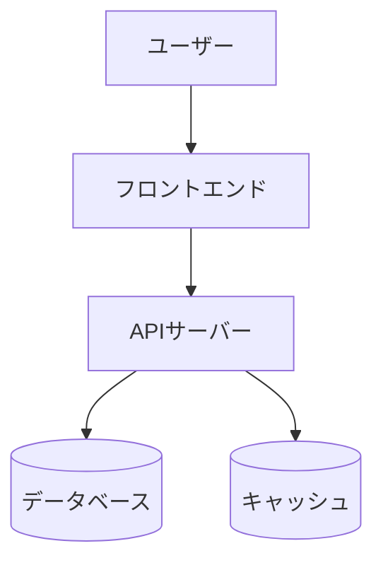

# ARCHITECTURE.md テンプレート

このテンプレートは、プロジェクトのARCHITECTURE.mdを生成する際の標準構造です。

---

# Architecture

## Overview

> **Note:** プロジェクトの詳細な概要については CLAUDE.md または AGENTS.md を参照してください。

[プロジェクトの簡潔な説明を1-2文で記載]

例:
- "このプロジェクトは、ユーザー認証とデータ管理を提供するREST APIです。"
- "React SPAとPython FastAPIバックエンドで構成される、タスク管理アプリケーションです。"

## System Diagram

システム全体のアーキテクチャを視覚化するMermaidダイアグラム。

**基本パターン:**



**カスタマイズ:**
- プロジェクトの実際のコンポーネントに合わせてノードを調整
- データフローや依存関係を明確に表現
- 外部サービスも含める

## External Dependencies

プロジェクトが依存する外部サービスやAPIのリスト。

| Service | Purpose | Configuration |
|---------|---------|---------------|
| PostgreSQL | メインデータストア | `DATABASE_URL` |
| Redis | セッションキャッシュ | `REDIS_URL` |
| SendGrid | メール送信 | `SENDGRID_API_KEY` |
| Stripe | 決済処理 | `STRIPE_SECRET_KEY` |
| AWS S3 | ファイルストレージ | `AWS_ACCESS_KEY_ID`, `AWS_SECRET_ACCESS_KEY` |

**含めるべき情報:**
- サービス名
- 使用目的
- 設定方法(環境変数など)

## Code Map

プロジェクトのディレクトリ構造と各部分の役割。

**ディレクトリツリー:**

```
project-root/
├── src/
│   ├── api/          # API エンドポイント
│   ├── models/       # データモデル
│   ├── services/     # ビジネスロジック
│   └── utils/        # ユーティリティ関数
├── tests/            # テストコード
├── config/           # 設定ファイル
└── docs/             # ドキュメント
```

**各ディレクトリの説明:**

### src/api/
REST APIエンドポイントの定義。各エンドポイントはルーティング、リクエスト検証、レスポンス生成を担当。

### src/models/
データベーススキーマとORMモデル。データ構造の定義とDB操作の抽象化。

### src/services/
ビジネスロジックの実装。外部API呼び出し、データ処理、複雑な操作を集約。

### src/utils/
共通のユーティリティ関数。ログ設定、ヘルパー関数、定数定義など。

### tests/
ユニットテストと統合テスト。pytestまたはJestを使用。

### config/
環境設定、ログ設定、その他の設定ファイル。

---

## テンプレート使用ガイド

1. **Overview**: CLAUDE.md/AGENTS.mdへの参照を必ず含める
2. **System Diagram**: プロジェクトに合わせてカスタマイズ
3. **External Dependencies**: 実際に使用している外部サービスのみ記載
4. **Code Map**: 実際のディレクトリ構造を反映し、各部分の役割を明確に説明
