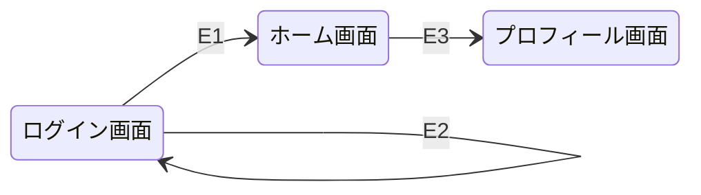

# 画面遷移図生成スキル

## 解析プロセス

### Step 1: フレームワーク特定

コードベースを調査してフレームワークとルーティング方式を特定する。
`AGENTS.md`、`CLAUDE.md`、`package.json`、設定ファイル、ディレクトリ構造を確認する。

### Step 2: 画面（ルート）の列挙

ルーター設定・ファイルベースルーティング・コンポーネント構造から全画面を特定する。
各画面に対して簡潔な表示名を付ける（例: `/users/:id` → `ユーザー詳細画面`）。

### Step 3: 遷移とイベントの収集

各画面から発生する遷移を探索し、以下を収集する:

- **イベント**: 何を起因として遷移するか（ボタンクリック、フォーム送信、タイムアウト、認証コールバックなど）
- **ガード条件**: 遷移に条件がある場合のみ記録（認証状態、権限、バリデーション結果など）
- **遷移先**: 遷移後に表示される画面

### Step 4: イベント番号の付与

収集した遷移イベントに `E1, E2, E3, ...` の連番を付与する。
同一画面から発生する複数の遷移も別番号とする。

### Step 5: 出力生成

#### Mermaid 画面遷移図

`stateDiagram-v2` を使用する。矢印ラベルにイベント番号を付けてイベント一覧表と紐づける。



画面名にスペースや特殊文字が含まれる場合は `"` で囲む:
```
    "ユーザー詳細画面" --> "注文一覧画面" : E4
```

#### イベント一覧表

| # | イベント内容 | ガード | 遷移後の画面 |
|---|------------|--------|-------------|
| E1 | ログインボタンクリック | 認証成功時 | ホーム画面 |
| E2 | ログインボタンクリック | 認証失敗時 | ログイン画面（エラー表示） |
| E3 | プロフィールリンククリック | ログイン済み | プロフィール画面 |
| E4 | ログアウトボタンクリック | - | （アプリ終了） |

ガード条件がない遷移のガード列は `-` と記載する。

## 出力ガイドライン

- 画面名はユーザーが理解しやすい表記にする（コードの命名規則に合わせつつ日本語可）
- ダイナミックルート（`/items/:id`）は代表名（`アイテム詳細画面`）にまとめる
- モーダル・ドロワーなど URL が変わらない UI は原則省略し、重要なものは注記
- 遷移が多い場合（目安: 20件超）はサブフロー（認証フロー・メインフロー等）に分割して可読性を確保
