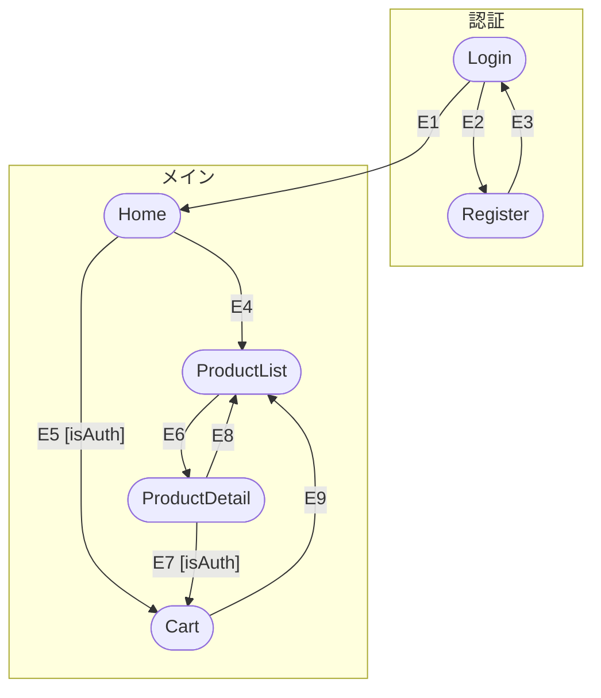

# 出力例: ECサイト（React Router v6）

## 前提

- フレームワーク: React + React Router v6
- 6画面構成のシンプルなECサイト
- 認証機能あり（ログイン必須の画面が存在）

## 画面一覧

| 画面ID | パス | 説明 |
|--------|------|------|
| Login | `/login` | ログイン画面 |
| Register | `/register` | 新規登録画面 |
| Home | `/` | トップページ |
| ProductList | `/products` | 商品一覧 |
| ProductDetail | `/products/:id` | 商品詳細 |
| Cart | `/cart` | カート |

## イベント表

| # | ソース | イベント | ガード | 遷移先 |
|---|--------|---------|--------|--------|
| E1 | Login | ログインボタン押下 | | Home |
| E2 | Login | 「新規登録はこちら」リンク押下 | | Register |
| E3 | Register | 登録完了 | | Login |
| E4 | Home | 「商品を見る」ボタン押下 | | ProductList |
| E5 | Home | カートアイコン押下 | isAuth | Cart |
| E6 | ProductList | 商品カード押下 | | ProductDetail |
| E7 | ProductDetail | 「カートに追加」ボタン押下 | isAuth | Cart |
| E8 | ProductDetail | 「一覧に戻る」リンク押下 | | ProductList |
| E9 | Cart | 「買い物を続ける」リンク押下 | | ProductList |

## Mermaid 図

## 出力時の注意点

1. **イベント番号の一致**: イベント表の `#` 列と Mermaid 図の矢印ラベルが完全に一致すること
2. **ガード条件の表記**: Mermaid 図ではガード条件を `"E5 [isAuth]"` のように `"` で囲んで角括弧で表記する
3. **subgraph**: 論理的にまとまりのある画面をグループ化する（認証系、メイン系など）
