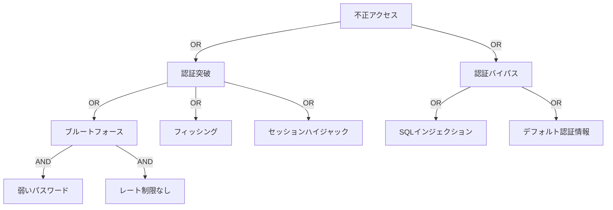

# Attack Tree 構築パターン

Attack Tree（攻撃木）は、システムへの攻撃経路を視覚化し、分析するための階層的な手法です。

## Attack Tree の基本概念

### 構造
```
目標（Root）
├── サブ目標1（AND/OR）
│   ├── 攻撃手法1-1
│   └── 攻撃手法1-2
└── サブ目標2（AND/OR）
    ├── 攻撃手法2-1
    └── 攻撃手法2-2
```

### ノードタイプ
- **AND**: すべての子ノードが成功する必要がある
- **OR**: いずれかの子ノードが成功すれば良い

### 属性
- **Cost（コスト）**: 攻撃の実行コスト
- **Difficulty（難易度）**: 攻撃の実行難易度
- **Detection（検出可能性）**: 攻撃が検出される確率
- **Success（成功率）**: 攻撃の成功確率

## パターン1: 不正アクセス

```
目標: システムに不正アクセス
├── OR: 認証を突破
│   ├── AND: ブルートフォース攻撃
│   │   ├── 弱いパスワードポリシー
│   │   └── レート制限なし
│   ├── クレデンシャルスタッフィング
│   ├── AND: フィッシング攻撃
│   │   ├── フィッシングメール送信
│   │   └── ユーザーが認証情報を入力
│   └── セッションハイジャック
└── OR: 認証をバイパス
    ├── SQLインジェクション
    ├── 認証ロジックの脆弱性
    └── デフォルト認証情報
```

### 属性評価
```yaml
ブルートフォース攻撃:
  cost: Low
  difficulty: Low (レート制限なしの場合)
  detection: High
  success: Medium

SQLインジェクション:
  cost: Low
  difficulty: Medium
  detection: Medium
  success: High (脆弱性がある場合)

フィッシング攻撃:
  cost: Low
  difficulty: Low
  detection: Low
  success: Medium
```

## パターン2: データ漏洩

```
目標: 機密データの窃取
├── OR: データベースから取得
│   ├── AND: SQLインジェクション
│   │   ├── 入力検証の欠如
│   │   └── パラメータ化クエリ未使用
│   ├── AND: データベース直接アクセス
│   │   ├── 露出したデータベースポート
│   │   └── 弱い認証情報
│   └── バックアップファイルの取得
├── OR: APIから取得
│   ├── AND: IDOR（Insecure Direct Object Reference）
│   │   ├── 認可チェック不足
│   │   └── 予測可能なID
│   ├── 過剰な情報返却
│   └── AND: APIキー漏洩
│       ├── ソースコードにハードコード
│       └── GitHubに公開
└── OR: ファイルシステムから取得
    ├── パストラバーサル
    ├── 不適切なファイル権限
    └── バックアップファイルの露出
```

### 対策マッピング
```yaml
SQLインジェクション:
  - パラメータ化クエリ使用
  - 入力検証
  - WAF導入

IDOR:
  - すべてのリソースアクセスで認可チェック
  - UUID使用
  - アクセス制御リスト

パストラバーサル:
  - パス正規化
  - ホワイトリスト検証
  - chroot jail
```

## パターン3: サービス妨害（DoS）

```
目標: サービスを停止させる
├── OR: リソース枯渇
│   ├── AND: アプリケーション層DoS
│   │   ├── レート制限なし
│   │   └── 大量リクエスト送信
│   ├── AND: CPU枯渇攻撃
│   │   ├── 計算量の多い処理
│   │   └── タイムアウトなし
│   └── AND: メモリ枯渇攻撃
│       ├── 大容量ファイルアップロード
│       └── ファイルサイズ制限なし
├── OR: ネットワーク層DoS
│   ├── DDoS攻撃
│   ├── SYN Flood
│   └── UDP Flood
└── OR: ロジック層DoS
    ├── 無限ループを引き起こす入力
    ├── 正規表現DoS（ReDoS）
    └── XML Bomb
```

### リスク評価
```yaml
DDoS攻撃:
  impact: Critical
  likelihood: Medium
  detection: High
  mitigation_cost: High

ReDoS:
  impact: High
  likelihood: Low
  detection: Medium
  mitigation_cost: Low
```

## パターン4: 権限昇格

```
目標: 管理者権限を取得
├── OR: 垂直権限昇格
│   ├── AND: SQLインジェクションで権限変更
│   │   ├── SQLインジェクション脆弱性
│   │   └── UPDATE権限あり
│   ├── AND: APIの認可チェック不足
│   │   ├── /admin/*エンドポイント
│   │   └── ログインのみチェック
│   └── パストラバーサルで設定ファイル変更
└── OR: 水平権限昇格
    ├── AND: IDOR経由
    │   ├── 他ユーザーのIDを推測
    │   └── 認可チェックなし
    └── セッションハイジャック
```

## パターン5: データ改ざん

```
目標: データを不正に変更
├── OR: データベース改ざん
│   ├── SQLインジェクション
│   ├── NoSQLインジェクション
│   └── 直接データベースアクセス
├── OR: ファイル改ざん
│   ├── パストラバーサル
│   ├── 不適切なファイル権限
│   └── AND: アップロード経由
│       ├── ファイルタイプ検証なし
│       └── 実行権限あり
└── OR: メモリ改ざん
    ├── バッファオーバーフロー
    └── Use-After-Free
```

## パターン6: サプライチェーン攻撃

```
目標: サプライチェーン経由で侵害
├── OR: 依存関係の侵害
│   ├── AND: 悪意のあるパッケージ
│   │   ├── タイポスクワッティング
│   │   └── パッケージ名の類似性
│   ├── 既知の脆弱性のあるバージョン
│   └── 依存関係の侵害（間接依存）
├── OR: ビルドプロセスの侵害
│   ├── AND: CI/CDパイプライン侵害
│   │   ├── 認証情報の漏洩
│   │   └── パイプライン設定の改ざん
│   └── ビルドサーバーの侵害
└── OR: 開発環境の侵害
    ├── 開発者マシンの侵害
    └── AND: ソースコードリポジトリ侵害
        ├── Git認証情報の漏洩
        └── コードの改ざん
```

### 対策
```yaml
依存関係管理:
  - SBOMの作成と管理
  - 定期的な脆弱性スキャン
  - 依存関係のロック（lock files）
  - 信頼できるレジストリのみ使用

CI/CDセキュリティ:
  - シークレット管理（Vault, AWS Secrets Manager）
  - パイプラインのコード化（Pipeline as Code）
  - ビルド成果物の署名
  - 最小権限でのジョブ実行
```

## Attack Tree 分析テンプレート

```markdown
# 攻撃木分析: [システム名]

## 目標
[攻撃者の最終目標]

## 攻撃経路

### 経路1: [経路名]
**タイプ:** AND/OR
**ステップ:**
1. [ステップ1]
2. [ステップ2]
3. [ステップ3]

**属性:**
- コスト: Low/Medium/High
- 難易度: Low/Medium/High
- 検出可能性: Low/Medium/High
- 成功率: Low/Medium/High

**前提条件:**
- [前提条件1]
- [前提条件2]

**対策:**
- [対策1]
- [対策2]

**リスク評価:**
- 影響度: Critical/High/Medium/Low
- 発生可能性: High/Medium/Low
- リスクレベル: Critical/High/Medium/Low

---

## リスク優先度

| 経路 | リスクレベル | 優先度 | 対策コスト |
|------|------------|-------|----------|
| 経路1 | Critical | 1 | Medium |
| 経路2 | High | 2 | Low |
```

## Mermaid記法でのAttack Tree



## 定量的分析

### コスト計算
```
総コスト = Σ(各ステップのコスト)
AND ノード: 最大コスト
OR ノード: 最小コスト
```

### 成功確率計算
```
AND ノード: P(成功) = P1 × P2 × ... × Pn
OR ノード: P(成功) = 1 - (1-P1) × (1-P2) × ... × (1-Pn)
```

### ROI（費用対効果）分析
```
ROI = (攻撃による利益 - 攻撃コスト) / 攻撃コスト
```

## ツール

### 手動作成
- Draw.io / diagrams.net
- Microsoft Visio
- Lucidchart

### 自動化ツール
- AttackTree+
- ADTool (Attack-Defense Trees)
- ThreatModeler

### コードベース
```python
# Pythonでの簡易Attack Tree表現
attack_tree = {
    'goal': '不正アクセス',
    'type': 'OR',
    'children': [
        {
            'name': 'ブルートフォース',
            'type': 'AND',
            'cost': 'Low',
            'difficulty': 'Low',
            'detection': 'High',
            'children': [
                {'name': '弱いパスワード', 'cost': 0},
                {'name': 'レート制限なし', 'cost': 0}
            ]
        },
        {
            'name': 'SQLインジェクション',
            'cost': 'Low',
            'difficulty': 'Medium',
            'detection': 'Medium'
        }
    ]
}
```

## 参考資料

- [Attack Trees - Bruce Schneier](https://www.schneier.com/academic/archives/1999/12/attack_trees.html)
- [OWASP Attack Trees](https://owasp.org/www-community/attacks/Attack_tree)
- [MITRE ATT&CK Framework](https://attack.mitre.org/)
