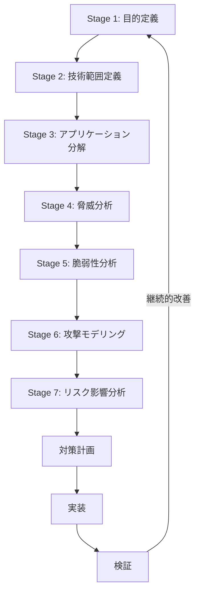

# PASTA (Process for Attack Simulation and Threat Analysis) フレームワーク

PASTAは、リスク中心の7段階脅威モデリングフレームワークです。

## 7つのステージ

### Stage 1: Define Objectives (目的の定義)

**目的:** ビジネス目標とセキュリティ要件を定義

**成果物:** ビジネス目標の文書化、セキュリティとコンプライアンス要件、ビジネス影響分析

**主要質問:**
- ビジネスの主な目的は何か？
- 重要な資産は何か?
- コンプライアンス要件は何か？（GDPR、HIPAA、PCI-DSS等）
- RTO/RPOは？
- 許容可能なリスクレベルは？

---

### Stage 2: Define Technical Scope (技術範囲の定義)

**目的:** アプリケーションの技術的な境界とコンポーネントを特定

**成果物:** アーキテクチャ図、データフローダイアグラム（DFD）、技術スタック一覧、外部依存関係

**チェックリスト:**
- アプリケーションコンポーネント
- データベースとストレージ
- 外部API連携
- 認証・認可メカニズム
- ネットワークインフラ
- クラウドサービス
- サードパーティライブラリ

---

### Stage 3: Application Decomposition (アプリケーション分解)

**目的:** アプリケーションを詳細に分解し、データフローを理解

**成果物:** 詳細データフローダイアグラム、ユースケース/アビューズケース、エントリー/エグジットポイント、資産の特定と分類

**資産分類:**
- **Critical**: ユーザー認証情報、決済情報、個人識別情報（PII）
- **High**: セッショントークン、APIキー、ビジネスロジック
- **Medium**: ログデータ、設定ファイル
- **Low**: 公開コンテンツ、静的アセット

**主要エントリーポイント:**
- ログインフォーム、ユーザー登録、パスワードリセット
- API エンドポイント
- ファイルアップロード、検索機能

---

### Stage 4: Threat Analysis (脅威分析)

**目的:** 関連する脅威を特定し分析

**手法:** 脅威インテリジェンスの収集、業界固有の脅威分析、攻撃者プロファイリング

**脅威ソース:**
- **外部**: ハクティビスト、サイバー犯罪者、競合他社、国家支援型攻撃者
- **内部**: 悪意のある従業員、不注意な従業員、サードパーティベンダー

**脅威動機:** 金銭的利益、データ窃取、サービス妨害、評判の毀損

**脅威インテリジェンス:** CVE/NVDデータベース、MITRE ATT&CK、業界のインシデントレポート、セキュリティアドバイザリ

---

### Stage 5: Vulnerability Analysis (脆弱性分析)

**目的:** システムの脆弱性を特定

**手法:** コードレビュー、脆弱性スキャン、ペネトレーションテスト、設定レビュー

**分析領域:**
- **コードレベル**: 入力検証の不備、認証・認可の脆弱性、暗号化の不備、エラー処理、ロギング
- **設定レベル**: デフォルト認証情報、セキュリティヘッダー欠如、TLS設定の不備、不要なサービス
- **インフラレベル**: パッチ未適用、ネットワークセグメンテーション不足、ファイアウォール設定
- **依存関係レベル**: 既知の脆弱性のあるライブラリ、古いバージョンのフレームワーク

---

### Stage 6: Attack Modeling (攻撃モデリング)

**目的:** 攻撃経路とシナリオをモデル化

**手法:** Attack Trees、Attack Graphs、Kill Chain分析

**Attack Tree例:**
```
目標: 顧客データの窃取
├── OR: データベースから直接取得
│   ├── SQLインジェクション [CVSS: 9.8]
│   ├── データベース認証情報の漏洩 [CVSS: 8.1]
│   └── バックアップファイルの取得 [CVSS: 7.5]
└── OR: APIを介して取得
    ├── IDOR [CVSS: 8.2]
    ├── 認可チェックのバイパス [CVSS: 8.8]
    └── APIキーの漏洩 [CVSS: 7.3]
```

**Kill Chain分析:**
1. Reconnaissance（偵察） - 公開情報の収集、DNSレコードの列挙
2. Weaponization（武器化） - ペイロードの準備、スクリプトの作成
3. Delivery（配送） - 脆弱なエンドポイントへのリクエスト送信
4. Exploitation（悪用） - 脆弱性の実行
5. Installation（インストール） - Webシェルのアップロード
6. Command & Control（C2） - 継続的なデータ抽出
7. Actions on Objectives（目的達成） - データの窃取と外部送信

---

### Stage 7: Risk and Impact Analysis (リスクと影響の分析)

**目的:** リスクを評価し、優先順位付け

**リスク計算:** リスク = 脅威の発生可能性 × ビジネス影響度

**評価基準:**

**発生可能性:**
- High: 既知の脆弱性、簡単に悪用可能
- Medium: 悪用には中程度のスキルが必要
- Low: 高度なスキルと資源が必要

**ビジネス影響度:**
- Critical: ビジネス停止、多額の罰金、深刻な評判毀損
- High: 重大な財務損失、規制違反
- Medium: 限定的な財務損失
- Low: 最小限の影響

**リスクマトリクス:**
```
        影響度
        Low  Med  High Crit
発生  High  M    H    H    C
可能  Med   L    M    H    H
能性  Low   L    L    M    H
```

**リスク対応戦略:**
- **回避（Avoid）**: リスクの原因となる活動を停止（例: 脆弱な機能の廃止）
- **軽減（Mitigate）**: リスクの発生可能性や影響を低減（例: セキュリティコントロールの実装）
- **転嫁（Transfer）**: リスクを第三者に移転（例: サイバー保険、アウトソーシング）
- **受容（Accept）**: リスクを認識し受け入れる（例: 低リスクの脅威）

---

## PASTAワークフロー全体像



## 成果物チェックリスト

- ビジネス目標とセキュリティ要件の文書
- アーキテクチャ図とDFD
- 資産一覧と分類
- 脅威カタログ
- 脆弱性評価レポート
- Attack Trees
- リスク評価マトリクス
- 優先順位付き対策計画
