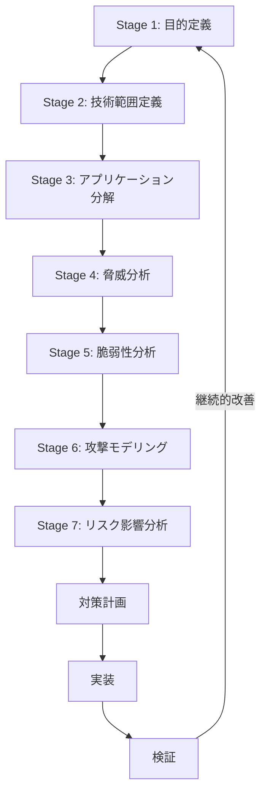

# PASTA (Process for Attack Simulation and Threat Analysis) フレームワーク

PASTAは、リスク中心の7段階脅威モデリングフレームワークです。

## 7つのステージ

### Stage 1: Define Objectives (目的の定義)

**目的:** ビジネス目標とセキュリティ要件を定義

**成果物:**
- ビジネス目標の文書化
- セキュリティとコンプライアンス要件
- アプリケーションのビジネス影響分析

**質問:**
- [ ] ビジネスの主な目的は何か？
- [ ] 重要な資産は何か？
- [ ] コンプライアンス要件は何か？（GDPR、HIPAA、PCI-DSS等）
- [ ] RTO（Recovery Time Objective）とRPO（Recovery Point Objective）は？
- [ ] 許容可能なリスクレベルは？

**テンプレート:**
```markdown
## ビジネス目標
- [目標1]: 顧客データの保護
- [目標2]: サービス可用性99.9%維持
- [目標3]: PCI-DSS準拠

## セキュリティ要件
- データ暗号化（保存時、通信時）
- 多要素認証（MFA）
- 監査ログの保持（最低1年）

## ビジネス影響
- データ漏洩: Critical（罰金、顧客信頼喪失）
- サービス停止: High（収益損失）
- 不正アクセス: High（法的責任）
```

---

### Stage 2: Define Technical Scope (技術範囲の定義)

**目的:** アプリケーションの技術的な境界とコンポーネントを特定

**成果物:**
- アーキテクチャ図
- データフローダイアグラム（DFD）
- 技術スタックの一覧
- 外部依存関係の特定

**チェックリスト:**
- [ ] アプリケーションコンポーネント
- [ ] データベースとストレージ
- [ ] 外部API連携
- [ ] 認証・認可メカニズム
- [ ] ネットワークインフラ
- [ ] クラウドサービス
- [ ] サードパーティライブラリ

**テンプレート:**
```markdown
## アーキテクチャコンポーネント

### フロントエンド
- React 18.2
- Next.js 14
- TailwindCSS

### バックエンド
- Node.js 20 + Express
- PostgreSQL 15
- Redis 7

### インフラ
- AWS (EC2, RDS, S3, CloudFront)
- Docker + Kubernetes
- Nginx

### 外部サービス
- Stripe (決済)
- SendGrid (メール)
- Auth0 (認証)

## 信頼境界
1. インターネット ←→ CDN/WAF
2. CDN/WAF ←→ Webサーバー
3. Webサーバー ←→ APIサーバー
4. APIサーバー ←→ データベース
```

---

### Stage 3: Application Decomposition (アプリケーション分解)

**目的:** アプリケーションを詳細に分解し、データフローを理解

**成果物:**
- 詳細データフローダイアグラム
- ユースケース/アビューズケース
- エントリー/エグジットポイント
- 資産の特定と分類

**データフロー分析:**
```
ユーザー
  ↓ (HTTPS)
CDN/WAF
  ↓ (HTTPS)
ロードバランサー
  ↓ (HTTP)
Webサーバー
  ↓ (HTTPS)
APIサーバー
  ↓ (TLS)
データベース
```

**資産分類:**
```markdown
## 機密資産

### Critical
- ユーザー認証情報（パスワードハッシュ）
- 決済情報（クレジットカード）
- 個人識別情報（PII）

### High
- セッショントークン
- APIキー
- ビジネスロジック

### Medium
- ログデータ
- 設定ファイル

### Low
- 公開コンテンツ
- 静的アセット
```

**エントリーポイント:**
- [ ] ログインフォーム
- [ ] ユーザー登録
- [ ] パスワードリセット
- [ ] API エンドポイント
- [ ] ファイルアップロード
- [ ] 検索機能

---

### Stage 4: Threat Analysis (脅威分析)

**目的:** 関連する脅威を特定し分析

**手法:**
- 脅威インテリジェンスの収集
- 業界固有の脅威分析
- 攻撃者プロファイリング

**脅威ソース:**
```markdown
## 外部脅威
- ハクティビスト
- サイバー犯罪者
- 競合他社
- 国家支援型攻撃者

## 内部脅威
- 悪意のある従業員
- 不注意な従業員
- サードパーティベンダー

## 脅威動機
- 金銭的利益
- データ窃取
- サービス妨害
- 評判の毀損
```

**脅威インテリジェンス:**
- CVE/NVDデータベース
- MITRE ATT&CK
- 業界のインシデントレポート
- セキュリティアドバイザリ

**テンプレート:**
```markdown
## 脅威シナリオ

### TS-001: アカウント乗っ取り
**攻撃者:** サイバー犯罪者
**動機:** 金銭的利益、データ窃取
**手法:**
- クレデンシャルスタッフィング
- フィッシング
- セッションハイジャック

**影響:**
- ユーザーデータ漏洩
- 不正取引
- 評判の毀損

**関連するCVE:**
- CVE-2024-XXXX: セッション管理の脆弱性
```

---

### Stage 5: Vulnerability Analysis (脆弱性分析)

**目的:** システムの脆弱性を特定

**手法:**
- コードレビュー
- 脆弱性スキャン
- ペネトレーションテスト
- 設定レビュー

**分析領域:**
```markdown
## コードレベル
- [ ] 入力検証の不備
- [ ] 認証・認可の脆弱性
- [ ] 暗号化の不備
- [ ] エラー処理の問題
- [ ] ロギングの不足

## 設定レベル
- [ ] デフォルト認証情報
- [ ] セキュリティヘッダー欠如
- [ ] TLS設定の不備
- [ ] 不要なサービス有効化

## インフラレベル
- [ ] パッチ未適用
- [ ] ネットワークセグメンテーション不足
- [ ] ファイアウォール設定の不備

## 依存関係レベル
- [ ] 既知の脆弱性のあるライブラリ
- [ ] 古いバージョンのフレームワーク
```

**脆弱性評価テンプレート:**
```markdown
## VUL-001: SQLインジェクション

**場所:** /api/users エンドポイント
**CWE:** CWE-89
**OWASP:** A03:2021 - Injection

**説明:**
ユーザー入力が適切にサニタイズされずにSQLクエリに使用されている

**影響:**
- データベース全体の漏洩
- データ改ざん
- 認証バイパス

**CVSSスコア:** 9.8 (Critical)

**再現手順:**
1. /api/users?id=1' OR '1'='1 にアクセス
2. すべてのユーザー情報が返却される

**対策:**
- パラメータ化クエリの使用
- 入力検証
- ORM使用
```

---

### Stage 6: Attack Modeling (攻撃モデリング)

**目的:** 攻撃経路とシナリオをモデル化

**手法:**
- Attack Trees
- Attack Graphs
- Kill Chain分析

**Attack Treeの作成:**
```
目標: 顧客データの窃取
├── OR: データベースから直接取得
│   ├── SQLインジェクション [CVSS: 9.8]
│   ├── データベース認証情報の漏洩 [CVSS: 8.1]
│   └── バックアップファイルの取得 [CVSS: 7.5]
└── OR: APIを介して取得
    ├── IDOR [CVSS: 8.2]
    ├── 認可チェックのバイパス [CVSS: 8.8]
    └── APIキーの漏洩 [CVSS: 7.3]
```

**Kill Chain分析:**
```markdown
## 攻撃シナリオ: データ漏洩

### 1. Reconnaissance（偵察）
- 公開されたAPIドキュメントの収集
- GitHubでのソースコード検索
- DNSレコードの列挙

### 2. Weaponization（武器化）
- SQLインジェクションペイロードの準備
- 自動化スクリプトの作成

### 3. Delivery（配送）
- 脆弱なエンドポイントへのリクエスト送信

### 4. Exploitation（悪用）
- SQLインジェクションの実行
- データベーススキーマの取得

### 5. Installation（インストール）
- Webシェルのアップロード（該当する場合）

### 6. Command & Control（C2）
- 継続的なデータ抽出

### 7. Actions on Objectives（目的達成）
- 顧客データの窃取
- データの外部送信
```

---

### Stage 7: Risk and Impact Analysis (リスクと影響の分析)

**目的:** リスクを評価し、優先順位付け

**リスク計算:**
```
リスク = 脅威の発生可能性 × ビジネス影響度
```

**評価基準:**

**発生可能性:**
- High: 既知の脆弱性、簡単に悪用可能
- Medium: 悪用には中程度のスキルが必要
- Low: 高度なスキルと資源が必要

**ビジネス影響度:**
- Critical: ビジネス停止、多額の罰金、深刻な評判毀損
- High: 重大な財務損失、規制違反
- Medium: 限定的な財務損失
- Low: 最小限の影響

**リスクマトリクス:**

```
        影響度
        Low  Med  High Crit
発生  High  M    H    H    C
可能  Med   L    M    H    H
能性  Low   L    L    M    H
```

**リスク評価テンプレート:**
```markdown
## リスク評価

### RISK-001: SQLインジェクションによるデータ漏洩

**脅威:** データベース侵害
**脆弱性:** VUL-001 (SQLインジェクション)

**発生可能性:** High
- 既知の脆弱性パターン
- 自動化ツールで容易に検出可能
- 公開エンドポイント

**ビジネス影響度:** Critical
- 全顧客データの漏洩（100万件以上）
- GDPR違反（最大2000万ユーロまたは年間売上の4%）
- 評判の深刻な毀損
- 顧客の大量離脱

**リスクレベル:** Critical

**対策コスト:** Medium
**対策期間:** 2週間

**ROI分析:**
- 潜在的損失: €20,000,000
- 対策コスト: €50,000
- ROI: 400:1

**優先度:** P0（即座に対応）

**推奨される対策:**
1. すべてのSQLクエリをパラメータ化 (2日)
2. 入力検証の実装 (3日)
3. WAFルールの設定 (1日)
4. ペネトレーションテストの実施 (5日)
5. セキュリティトレーニング (継続的)
```

**リスク対応戦略:**

```markdown
## 対応戦略

### 回避（Avoid）
リスクの原因となる活動を停止
例: 脆弱な機能の廃止

### 軽減（Mitigate）
リスクの発生可能性や影響を低減
例: セキュリティコントロールの実装

### 転嫁（Transfer）
リスクを第三者に移転
例: サイバー保険、アウトソーシング

### 受容（Accept）
リスクを認識し受け入れる
例: 低リスクの脅威
```

---

## PASTAワークフロー全体像



## 成果物チェックリスト

- [ ] ビジネス目標とセキュリティ要件の文書
- [ ] アーキテクチャ図とDFD
- [ ] 資産一覧と分類
- [ ] 脅威カタログ
- [ ] 脆弱性評価レポート
- [ ] Attack Trees
- [ ] リスク評価マトリクス
- [ ] 優先順位付き対策計画

## ツールとテクニック

### Stage 1-2
- ビジネス要件収集ツール
- アーキテクチャ図作成（Draw.io、Lucidchart）

### Stage 3
- データフローダイアグラムツール
- Microsoft Threat Modeling Tool

### Stage 4-5
- MITRE ATT&CK Navigator
- CVE/NVD データベース
- SAST/DASTツール

### Stage 6
- Attack Tree作成ツール
- OWASP Threat Dragon

### Stage 7
- リスク評価マトリクス
- ROI計算ツール

## 参考資料

- [PASTA Threat Modeling](https://versprite.com/tag/pasta-threat-modeling/)
- [Risk Centric Threat Modeling](https://www.wiley.com/en-us/Risk+Centric+Threat+Modeling%3A+Process+for+Attack+Simulation+and+Threat+Analysis-p-9780470500965)
